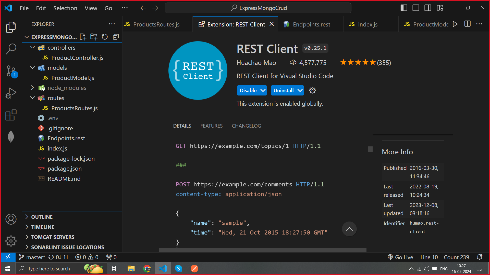

# ExpressMongoCrudServer

mkdir fresh  
cd fresh  
npm init -y  
npm i -g nodemon  
npm install express mongoose cookie-parser body-parser cors dotenv  
create index.js -> add baisc expressJS code  
nodemon index.js  

